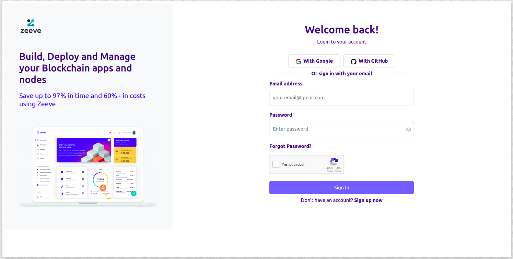
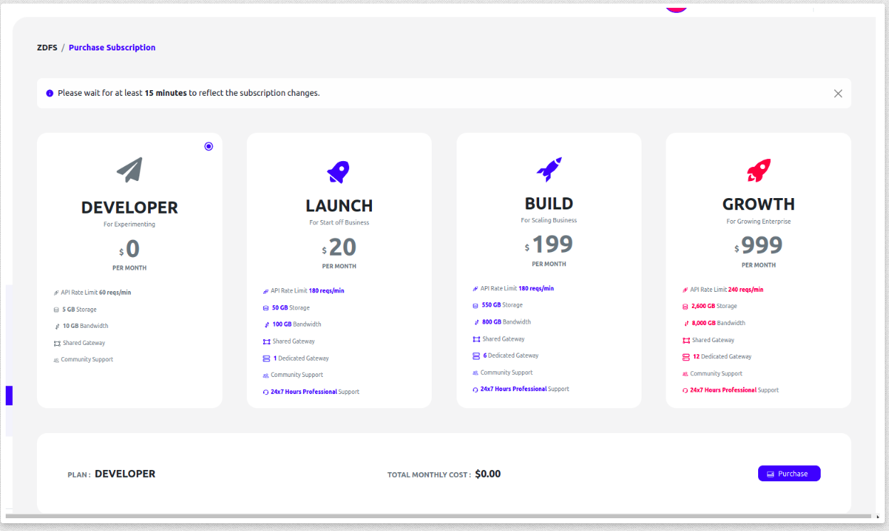
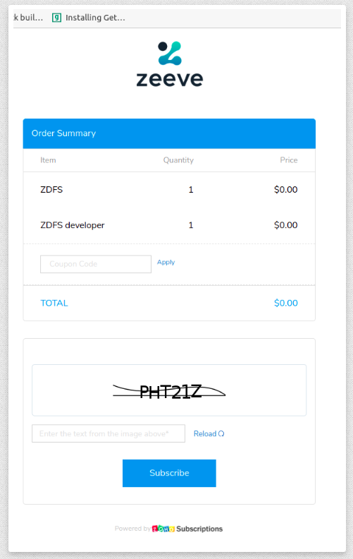
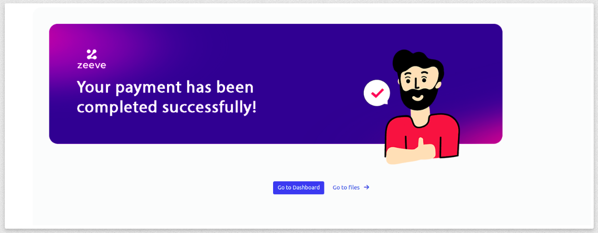

# [Zeeve Distributed File System](https://www.zeeve.io/docs/zeeveDistributedFileSystem.html)

## Overview

ZDFS is your secure and decentralised storage for your digital assets whether it be NFTs or other digital assets. 

It has been built by developers for developers and feature the most secure, easy to use and easy to integrate decentralised storage service. Now you don't need to hustle around [IPFS](https://docs.ipfs.io/concepts/what-is-ipfs/) complexities because ZDFS offers you the complete control over your contents using interactive ZDFS GUI. 

ZDFS allows you to upload your file, folder and content using an IPFS hash of 25GB in size. ZDFS ensures your content is always online in the IPFS network without worrying about unusual downtime and IPFS node management. 

ZDFS supports IPFS CLI out of the box and also provides Public HTTP APIs to integrate with your application and perform various actions on your content.

There is a series of steps you need to follow in order to access ZDFS service.

Purchase Subscription.
Create Access.
Usage.

## Setup Instructions

### Account Creation / Login

Please create an account if not created yet

[Follow Setup Instructions](./Account.md)

if you've a account do login

### Purchase Subscription

ZDFS offers you different subscription plans and you can optimize cost as per your requirement using the plan calculator. You need to purchase the endpoints of a particular plan to enjoy seamless services of ZDFS. You can purchase 'N' number of endpoints of a particular plan on a monthly basis.

NOTE: We are referring 1 ENDPOINT as 1 Access Key.

#### DEVELOPER

This plan is meant for experimenting purpose where you can enjoy the following features:

 1. API Rate Limit 60 reqs/min
 2. 5 GB Storage
 3. 10 GB Bandwidth
 4. Shared Gateway
 5. Community Support

You will be redirected to Payment Page

After Purchase successful

### Create Access

You need to generate an access token in order to use ZDFS APIs. You need to have AccessKey & AccessSecret or AccessToken for the same.

Go to Settings/My Accounts -> API Credentials. 

Click on the Create Key button. You will get the pop up form to take some information as described in the next step. 

Provide Key Name as per your choice.

Select ZDFS as Service Type.

Select Permissions as per your requirement. Actions are having direct relation with API methods present in the API Document (opens new window). 

Click on the Create Key button in order to generate it. 

Please write down AccessKey, AccessSecret and AccessToken at a safe place.

Close the pop by clicking on the Cancel button.

You can see all your generated access keys within the same section. 

### Usage
You can utilize ZDFS services in ample ways as per your use case. There are 3 ways in which you can use ZDFS as follows:

##### HTTP APIs
ZDFS offers you public APIs to integrate in your application. An access token is required to be sent with each request in the HTTP authorization header. Learn More(opens new window)

There are two types of HTTP APIs:

1. Pinning Service API (PSA).
2. Data APIs.

##### Pinning Service API (PSA)
Pinning Service API is meant for the purpose of performing operation on remote IPFS node of ZDFS. Pinning Service API spec is standardized specification for the developers and pinning service providers. Pinning Service API reduces the learning curve because of standardization. Learn More (opens new window).

##### Data APIs

ZDFS goes beyond in order to make the remote operation and integration of content with your application more effective. That's why your control on your content is not limited to just a few pinning methods but there are multiple other ways in which you fully access your content and make a seamless pipeline with your application. Learn More(opens new window)

