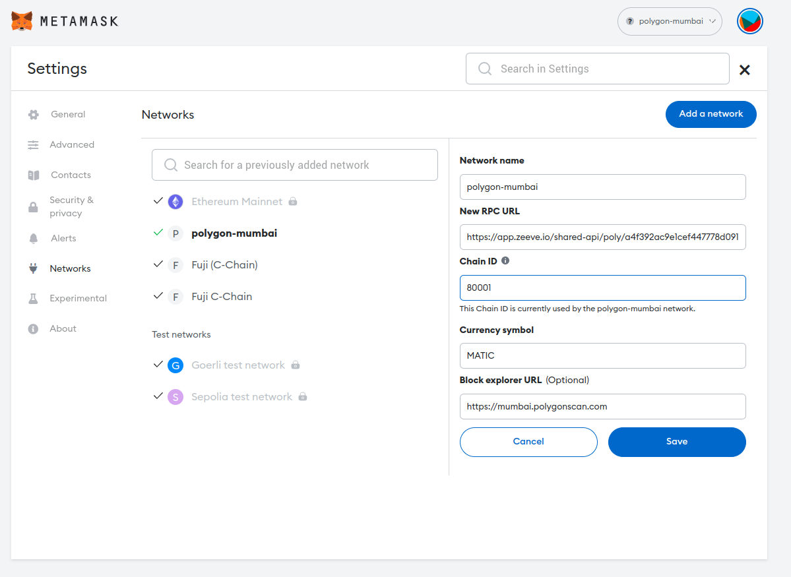
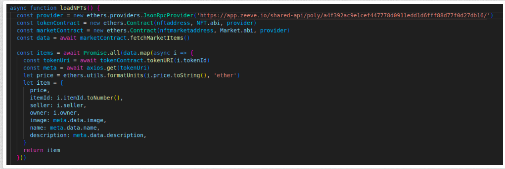

# NFT Marketplace Built With Polygon, Solidity, IPFS & Next.js


 
Description -> Create NFT Marketplace With Below Options.

* Home
* Sell Digital Asset
* My Digital Assets
* Creator Dashboard


### Run this project
#### How to setup locally?

To run this project locally, follow these steps.


#### Prerequisites

1. Install [Git](https://git-scm.com/book/en/v2/Getting-Started-Installing-Git)
2. Install [Node.js](https://nodejs.org/en/download)
3. Install [Yarn](https://classic.yarnpkg.com/lang/en/docs/install/#debian-stable) (optional)
4. Install [Hardhat](https://hardhat.org/hardhat-runner/docs/getting-started#installation)
5. Install [Metamask](https://metamask.io/download/)
6. Create [RPC API Enpoint](../../RPC.md) for Polygon Test Network Mumbai
7. Add [Custom Network RPC](https://support.metamask.io/hc/en-us/articles/360043227612-How-to-add-a-custom-network-RPC)
8. Buy [ZDFS Subscription](../../ZDFS.md) and Create Access Key


#### Application Setup Steps


##### 1. Clone the project locally, change into the directory, and install the dependencies:

```sh
git clone https://github.com/Zeeve-App/sample-dapps.git

cd sample-dapps/dapps/POLYGON-NFT-MARKETPLACE

# install using NPM or Yarn
npm install

# or

yarn
```

##### 2. Configuration

To deploy to Polygon test network, update the configurations located in __hardhat.config.js__ to use a private key and, deploy to a private RPC like Zeeve.

[Export Account Private Key](https://support.metamask.io/hc/en-us/articles/360015289632-How-to-export-an-account-s-private-key) and save it in .secret file


```javascript
require("@nomiclabs/hardhat-waffle");
const fs = require('fs');
const privateKey = fs.readFileSync(".secret").toString().trim() || "01234567890123456789";

module.exports = {
  defaultNetwork: "hardhat",
  networks: {
    hardhat: {
      chainId: 1337
    },
    /*
    mumbai: {
      // Zeeve
      url: `https://app.zeeve.io/shared-api/poly/a4f392ac9e1cef447778d0911edd1d6fff88d77f0d27db16/`
      accounts: [privateKey]
    },
    */
  },
  solidity: {
    version: "0.8.4",
    settings: {
      optimizer: {
        enabled: true,
        runs: 200
      }
    }
  }
};
```

##### 3. Deploy into Mumbai test network
Here, we will add the following configurations for the Mumbai test network as listed here:

* Network Name: Mumbai TestNet

* New RPC URL: https://app.zeeve.io/shared-api/poly/a4f392ac9e1cef447778d0911edd1d6fff88d77f0d27db16/

* Chain ID: 80001

* Currency Symbol: Matic



Save this, then you should be able to switch to and use the new network!

Finally, you will need some testnet Matic tokens in order to interact with the applications[.secret->privatekey].

To get these, you can visit the [Matic Faucet](https://faucet.polygon.technology/), inputting the address of the wallets that you would like to request the tokens for.
Deploying to the Matic / Polygon network.


Now that you have some Matic tokens, you can deploy to the Polygon network!


To do so, be sure that the address associated with the private key you are deploying your contract with has received some Matic tokens in order to pay the gas fees for the transaction.


To deploy to Matic, run the following command:

```sh
  npx hardhat run scripts/deploy.js --network mumbai
```

Once the contracts have been deployed, you should be able to update the contract addresses in your project and test on the new network 🎉!

**File Name: config.js**


**change to smart contract deployed address:**


**Change the JSON Provider in index.js file loadNFTs()**

    const provider = new ethers.providers.JsonRpcProvider()

**Change to**

    const provider = new ethers.providers.JsonRpcProvider('https://app.zeeve.io/shared-api/poly/a4f392ac9e1cef447778d0911edd1d6fff88d77f0d27db16/')




##### 4. Run Application

Then good to up the server, Run below command

```sh  
    npm run dev
```
    
After Deploying to Mumbai Test Network, you scan your address and see what all transactions occurred.


Finally Here is the NFT Marketplace!


Congratulations! You've deployed a NFT Marketplace to Polygon.

Click on Sell Digital Asset


Click on Home


Happy Coding! 💓


