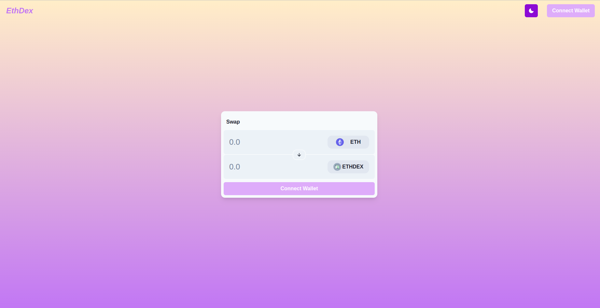
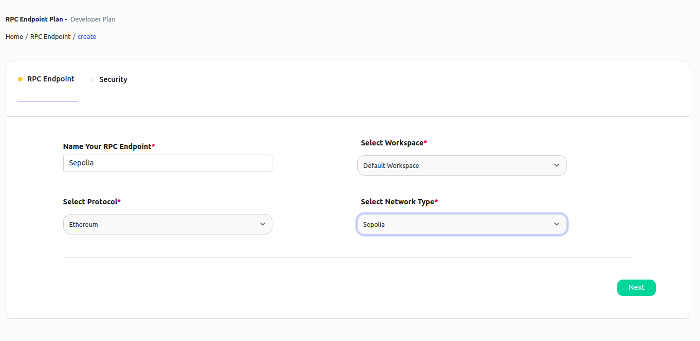
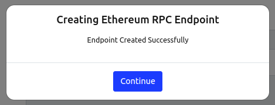
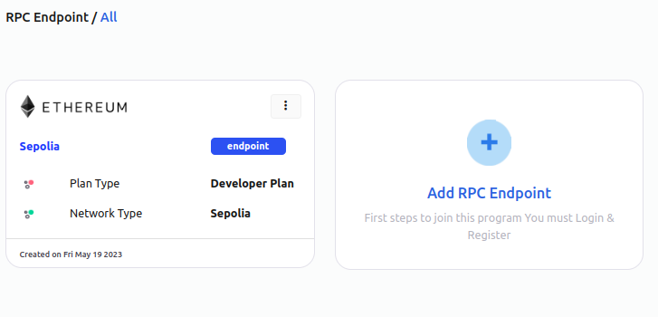
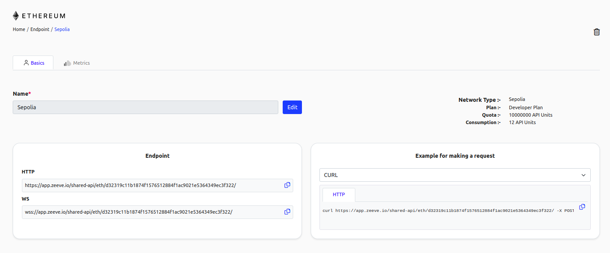
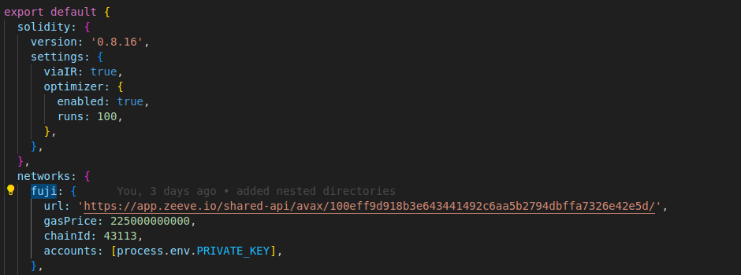

# eth-dex


Description -> Basic Ethereum decentralized exchange

## Run this project

### How to setup locally?

To run this project locally, follow these steps.


#### Prerequisites

1. Install [Git](https://git-scm.com/book/en/v2/Getting-Started-Installing-Git)
2. Install [Node.js](https://nodejs.org/en/download)
3. Install [Yarn](https://classic.yarnpkg.com/lang/en/docs/install/#debian-stable) (optional)
4. Install [Truffle](https://trufflesuite.com/docs/truffle/how-to/install/) Truffle v5.0.9 (core: 5.0.9)
5. Install [Metamask](https://metamask.io/download/)
6. Create [RPC API Enpoint](../../RPC.md) for Ethereum Test Network Sepolia 
  
  Please follow screenshots
  
  
  
  
  


7. Add [Custom Network RPC](https://support.metamask.io/hc/en-us/articles/360043227612-How-to-add-a-custom-network-RPC)

    1. Sepolia url: 'https://app.zeeve.io/shared-api/eth/f7d5b6624c939b41b58bc6df223df685bde85f1058f03dbe/'
    2. Chain Id: 11155111

8. Fund your wallet from the [Sepolia Faucet](https://faucet-sepolia.rockx.com/)


#### Application Setup Steps

1. Clone the project locally, change into the directory, and install the dependencies:

```sh
git clone https://github.com/Zeeve-App/sample-dapps.git

cd sample-dapps/dapps/eth-dex
```

2. `npm install`

3. Update truffle-config.js file

```javascript

var HDWalletProvider = require("truffle-hdwallet-provider");
var mnemonic = "your_metamask_wallet_passphrase";

module.exports = {
  networks: {
    development: {
      host: '127.0.0.1',
      port: 7545,
      network_id: '*',
    },
    sepolia: {
      provider: function() { 
       return new HDWalletProvider(mnemonic, "https://app.zeeve.io/shared-api/eth/f7d5b6624c939b41b58bc6df223df685bde85f1058f03dbe/");
      },
      network_id: 11155111,
      gas: 4500000,
      gasPrice: 10000000000,
    }
  },
  contracts_directory: './src/contracts/',
  contracts_build_directory: './build/contracts/',
  test_file_extension_regexp: /.*\.test.ts$/,
  compilers: {
    solc: {
      version: '0.8.14',
      optimizer: {
        enabled: true,
        runs: 200,
      },
      evmVersion: 'petersburg',
    },
  },
};


```

5. Compile the contract by running the `truffle compile` command

6. Deploy the smart contract on the Sepolia Ethereum test network by running the `truffle migrate --network sepolia` command

7. `npm run dev`


