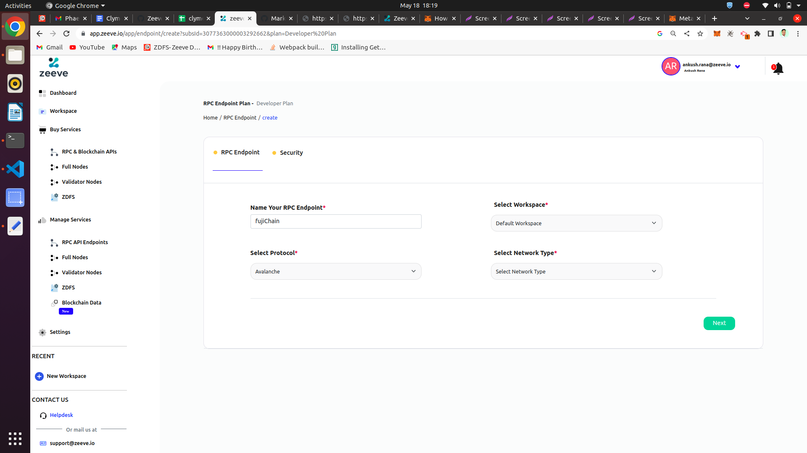
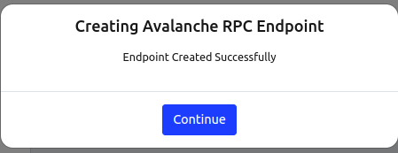
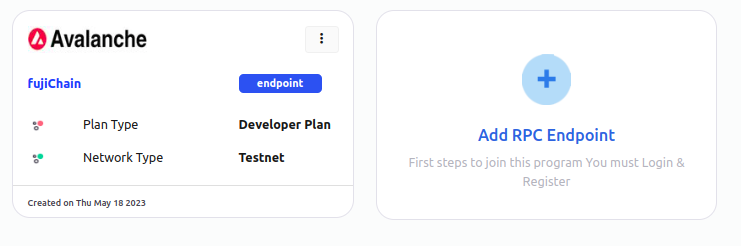
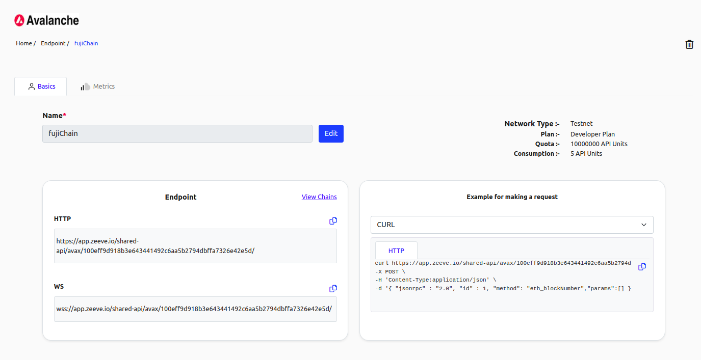
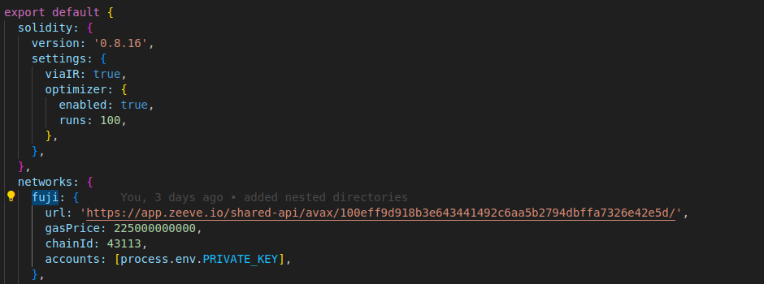

# Avax Gods - Online Multiplayer Web3 NFT Card Game


Description -> Web3 based battle game.

## Run this project

### How to setup locally?

To run this project locally, follow these steps.


#### Prerequisites

1. Install [Git](https://git-scm.com/book/en/v2/Getting-Started-Installing-Git)
2. Install [Node.js](https://nodejs.org/en/download)
3. Install [Yarn](https://classic.yarnpkg.com/lang/en/docs/install/#debian-stable) (optional)
4. Install [Hardhat](https://hardhat.org/hardhat-runner/docs/getting-started#installation)
5. Install [Metamask](https://metamask.io/download/)
6. Create [RPC API Enpoint](../../RPC.md) for Avalanche Test Network Fuji(C-chain)
  <!-- 
  
  
  
   -->


7. Add [Custom Network RPC](https://support.metamask.io/hc/en-us/articles/360043227612-How-to-add-a-custom-network-RPC)

    1. Fuji url: 'https://app.zeeve.io/shared-api/avax/100eff9d918b3e643441492c6aa5b2794dbffa7326e42e5d/'
    2. Chain Id: 43113

8. Fund your wallet from the [Avax Faucet](https://faucet.avax.network/)


#### Application Setup Steps

##### 1. Clone the project locally, change into the directory, and install the dependencies:

```sh
git clone https://github.com/Zeeve-App/sample-dapps.git

cd sample-dapps/dapps/project_web3_battle_game
```

##### Instructions on setting up the Web3 part of the project

1. `cd web3`

<!-- 1. `npx hardhat` -> y → typescript → enter → enter -->

<!-- 2. `npm install @openzeppelin/contracts dotenv @nomiclabs/hardhat-ethers` + Hardhat packages `npm install --save-dev "hardhat@^2.12.0" "@nomicfoundation/hardhat-toolbox@^2.0.0"` -->

2. `npm install`

3. Create a `.env` file and specify a PRIVATE_KEY variable.

4. To get to the private key, do the following steps:

  1. Click on the identicon in the top right.
  2. Select the account you'd like to export.
  3. On the account page, click on the menu (three dots) in the upper right corner, and then on the "Account Details" button.
  4. Click “Export Private Key”.
  5. To access your private key, you'll now need to enter your wallet password. Once you've done so, click “Confirm” to proceed.
  6. Your private key will now be revealed. Click to copy it, and save it somewhere safe. (Note: we aren't showing it in the below screenshot for obvious reasons --   but yours will be there.)
  7. Click “Done” to close the screen.


  [Get Private Key](https://support.metamask.io/hc/en-us/articles/360015289632-How-to-export-an-account-s-private-key)

  and update .env file
  

5. Compile the contract by running the `npx hardhat compile` command

6. Deploy the smart contract on the Fuji test network by running the `npx hardhat run scripts/deploy.ts --network fuji` command

  Move the `/artifacts/contracts/AVAXGods.json` file to the `/contract` folder on the frontend application [client](./client/)
  Copy the address of the deployed contract from the terminal and paste it into the `/contract/index.js` file of the frontend application [client](./client/)


##### Instructions on setting up the client part of the project


1. `cd client`

2. `npm install`

3. `npm run dev`


